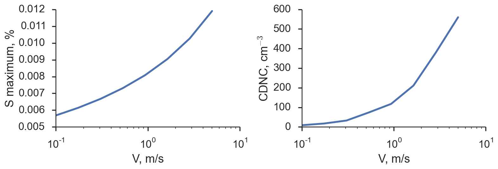

# Parcel Model


This is an implementation of a simple, adiabatic cloud parcel model for use in aerosol-cloud interaction studies. It is based on the model used by Nenes et al (2001)[^Nenes2001], but with several key modifications:

* Implementation of \\( \kappa \\)-Kohler theory for condensation physics[^pk2007]
* Extension of model to handle arbitrary sectional representations of aerosol populations, based on user-controlled empirical or parameterized size distributions
* Improved, modular numerical framework for integrating the model, including bindings to several different stiff integrators:
 * `lsoda` - [scipy ODEINT wrapper](http://docs.scipy.org/doc/scipy/reference/generated/scipy.integrate.odeint.html)
 * `vode, lsode*, lsoda*` - ODEPACK via [odespy](https://github.com/hplgit/odespy)[^hplgit]
 * `cvode` - SUNDIALS via [Assimulo](http://www.jmodelica.org/assimulo_home/index.html#)

among other details. It also includes a library of droplet activation routines and scripts/notebooks for evaluating those schemes against equivalent calculations done with the parcel model.

Updated code can be found the project [github repository](https://github.com/darothen/parcel_model). If you'd like to use this code or have any questions about it, please [contact the author][author_email]. In particular, if you use this code for research purposes, be sure to carefully read through the model and ensure that you have tweaked/configured it for your purposes (i.e., modifying the accomodation coefficient, \\(a_C\\); other derived quantities). 

## Model Setup


No setup is necessarily required to run the model, although the main derivative function used by the numerical integrator has been Cythonized to improve performance. To use this optimized function, its module must be built by invoking from the cloned repository:

```bash
$ python setup.py build_ext --inplace
```

You may need to over-ride in flags [setup.py](setup.py) depending on the OpenMP flag used by your compiler. Then, when the model runs, the number of threads used to calculate the derivative function is controlled by the environmental variable `OMP_NUM_THREADS`.

In addition to the Python-based re-implementations of some activation parameterizations, original versions of those schemes provided by their authors may be available. Please [contact me][author_email] if you're interested in the code for these schemes, and I'll facilitate a discussion between you and the author of the scheme you're interested in.


## Dependencies

Several basic scientific Python libraries are needed to run the model, including:

1. NumPy
2. SciPy
3. Pandas
4. Cython (optional - *highly* recommended)
5. [odespy](https://github.com/hplgit/odespy) (optional - unifed ODEPACK solver interface)
6. [Assimulo](http://www.jmodelica.org/assimulo) (optional - wrapper for [SUNDIALS CVODE](http://computation.llnl.gov/casc/sundials/main.html) solver)

This model was developed, tested, and used with the the [Anaconda](https://store.continuum.io/cshop/anaconda/) scientific Python distribution. It is *highly* recommended that you install and run the model within the Anaconda ecosystem.

## Basic Example

The following example illustrates how to run the model with a single, lognormal aerosol mode over a range of updraft speeds, calculating the maximum supersaturation (\\(S_\text{max}\\)) and activated cloud droplet number concentrations:

```python
import numpy as np
import parcel_model as pm

## Set background meteorology conditions
P0 = 77500. # Pressure, Pa
T0 = 286.   # Temperature, K
S0 = -0.02  # Supersaturation, 1-RH (98% here)

## Make the aerosol
aer = pm.AerosolSpecies('ammonium sulfate', 
						pm.Lognorm(mu=0.015, sigma=1.2, N=850.),
						kappa=0.54, bins=200)

## Loop over some updraft speeds and save the supersaturation max
## and the number concentration activated
Vs = np.logspace(-1, np.log10(5,), 8.) # 0.1 - 5.0 m/s
Smaxes, Nacts = [], []
for V in Vs:
    ## Initialize the model
    model = pm.ParcelModel([aer,], V, T0, S0, P0)
    par_out, aer_out = model.run(t_end=2500., dt=0.05, solver='cvode',
                                 output='dataframes')

    ## Extract the supersaturation/activation details from the model
    ## output
    S_max = par_out['S'].max()
    time_at_Smax = par_out['S'].argmax()
    wet_sizes_at_Smax = aer_out['ammonium sulfate'].ix[time_at_Smax]
    wet_sizes_at_Smax = np.array(wet_sizes_at_Smax.tolist())
    
    frac_eq, _ = pm.act_fraction(S_max, T0, wet_sizes_at_Smax, 
                                 aer.kappa, aer.r_drys, aer.Nis)
    Nact_eq = frac_eq*aer.distribution.N

    ## Save the output
    Smaxes.append(S_max)
    Nacts.append(Nact_eq)

    print "%3.2f m/s: Smax = %1.3f%% | Nact = %4.1f" % (V, S_max*100, Nact_eq)
```

Running the code should give console output like the following:

```
0.10 m/s: Smax = 0.569% | Nact =  8.8
0.17 m/s: Smax = 0.614% | Nact = 17.6
0.31 m/s: Smax = 0.667% | Nact = 32.7
0.53 m/s: Smax = 0.731% | Nact = 73.9
0.94 m/s: Smax = 0.808% | Nact = 117.6
1.64 m/s: Smax = 0.905% | Nact = 211.1
2.86 m/s: Smax = 1.027% | Nact = 379.3
5.00 m/s: Smax = 1.190% | Nact = 559.9
```

Or, in a visual form if you choose to save it and plot it:



## Development

[http://github.com/darothen/parcel_model]()

Please fork this repository if you intend to develop the model further so that the code's provenance can be maintained.

## License

[All scientific code should be licensed](http://www.astrobetter.com/the-whys-and-hows-of-licensing-scientific-code/). This code is released under the New BSD (3-clause) [license](LICENSE).

[author_email]: mailto:darothen@mit.edu

[^Nenes2001]: [Nenes et al, 2001](http://nenes.eas.gatech.edu/Preprints/KinLimitations_TellusPP.pdf)
[^pk2007]: [Petters and Kredenweise, 2007](http://www.atmos-chem-phys.net/7/1961/2007/acp-7-1961-2007.html)
[^hplgit]: [H. P. Langtangen and L. Wang, 2013](https://github.com/hplgit/odespy)
