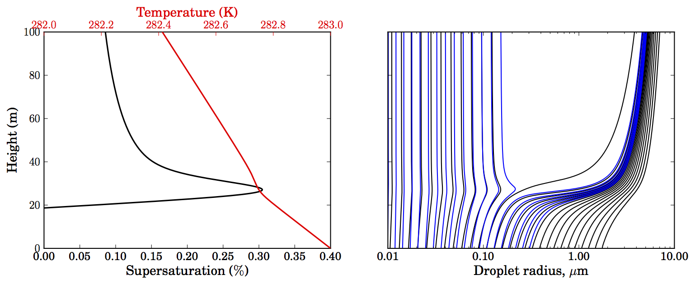

pyrcel: cloud parcel model
==========================



[](https://zenodo.org/badge/latestdoi/12927551)[](https://badge.fury.io/py/pyrcel)[](https://github.com/darothen/pyrcel/actions/workflows/ci.yml)[](http://pyrcel.readthedocs.io/en/latest/index.html)


This is an implementation of a simple, adiabatic cloud parcel model for use in
aerosol-cloud interaction studies. [Rothenberg and Wang (2016)](http://journals.ametsoc.org/doi/full/10.1175/JAS-D-15-0223.1) discuss the model in detail and its improvements
 and changes over [Nenes et al (2001)][nenes2001]:

* Implementation of κ-Köhler theory for condensation physics ([Petters and
Kreidenweis, 2007)][pk2007]
* Extension of model to handle arbitrary sectional representations of aerosol
populations, based on user-controlled empirical or parameterized size distributions
* Improved, modular numerical framework for integrating the model, including bindings
to several different stiff integrators:
    - ~~`lsoda` - [scipy ODEINT wrapper](http://docs.scipy.org/doc/scipy/reference/generated/scipy.integrate.odeint.html)~~
    - ~~`vode, lsode*, lsoda*` - ODEPACK via [odespy][hplgit]~~
    - `cvode` - SUNDIALS via [Assimulo](http://www.jmodelica.org/assimulo_home/index.html#)

among other details. It also includes a library of droplet activation routines and scripts/notebooks for evaluating those schemes against equivalent calculations done with the parcel model.

> [!WARNING]
> As of version 1.3, the `cvode` (numba + Assimulo) backend is the one used in all
> publications, so users shouldn't expect any inconsistencies with historical results.
> A second, JAX/[diffrax][diffrax]-based backend is now available and validated against
> `cvode`; see [Experimental: JAX / diffrax backend (v2)](#experimental-jax--diffrax-backend-v2)
> below.

Updated code can be found the project [github repository](https://github.com/darothen/pyrcel). If you'd like to use this code or have any questions about it, please [contact the author][author_email]. In particular, if you use this code for research purposes, be sure to carefully read through the model and ensure that you have tweaked/configured it for your purposes (i.e., modifying the accomodation coefficient); other derived quantities).

[Detailed documentation is available](http://pyrcel.readthedocs.org/en/latest/index.html), including a [scientific description](http://pyrcel.readthedocs.org/en/latest/sci_descr.html), [installation details](http://pyrcel.readthedocs.org/en/latest/install.html), and a [basic example](http://pyrcel.readthedocs.org/en/latest/examples/basic_run.html) which produces a figure like the plot at the top of this page.

Quick Start
-----------

The easiest way to run `pyrcel` from source is with [`uv`](https://docs.astral.sh/uv/),
a fast Python package manager.

Clone or download this repo, then **cd** into the top-level folder from a terminal.
From there, execute:

``` shell
$ uv run python examples/jax/basic_run.py
```

`uv` will automatically create an isolated environment and install all dependencies.
The first call compiles JAX kernels; subsequent calls are fast.

Experimental: JAX / diffrax backend (v2)
----------------------------------------

A second backend reimplements the parcel model on top of [JAX][jax] and
[diffrax][diffrax], replacing `numba` and Assimulo/CVode. It is numerically validated
against the original `cvode` model (frozen golden fixtures): peak supersaturation agrees
to better than 0.1% and activated fraction to within `1e-3`. The migration is documented
in [`docs/design/jax-diffrax-migration.md`](docs/design/jax-diffrax-migration.md), and
the two backends are benchmarked in [`tools/bench/`](tools/bench/README.md).

Why a second backend:

* **No SUNDIALS/conda dependency** — installs from PyPI with `pip install "pyrcel[jax]"`.
* **Autodiff** — exact gradients of, e.g., `S_max` with respect to the initial state,
  the updraft `V`, or the accommodation coefficient (sensitivity studies, emulator
  training) — something the numba/CVode stack cannot provide.
* **Batching/GPU** — `jax.vmap` runs ensembles of parcels in one compiled call.

```python
import pyrcel as pm

sulfate = pm.AerosolSpecies(
    "sulfate", pm.Lognorm(mu=0.05, sigma=2.0, N=1000.0), kappa=0.54, bins=50
)
model = pm.ParcelModelJAX([sulfate], V=1.0, T0=283.15, S0=-0.02, P0=85000.0, console=True)
parcel, aerosols = model.run(t_end=200.0, output_dt=1.0, terminate=True, progress=True)
print(model.summary()["S_max"])
```

A time-varying updraft is a `pyrcel.InterpolatedUpdraft(ts=..., vs=...)` passed as `V`.
The differentiable/batchable core (`pyrcel.integrator_diffrax`, `pyrcel.equilibrate_jax`,
`pyrcel.parcel_aux_jax`) is usable directly for `jit`/`grad`/`vmap`; `ParcelModelJAX` is
the interactive convenience layer (progress meter + summary table). float64 is required
and enabled automatically.

Installation
------------

Install `pyrcel` with [`uv`](https://docs.astral.sh/uv/) (recommended) or `pip`.

**From PyPI (recommended):**

```shell
$ pip install pyrcel
```

JAX (CPU) is included by default. No extras needed for standard use.

**From source:**

```shell
$ git clone https://github.com/darothen/pyrcel.git && cd pyrcel
$ uv sync
$ uv run python examples/jax/basic_run.py
```

**GPU support (CUDA 12):**

```shell
$ pip install "pyrcel[gpu]"
```

Requirements
------------

**Required**

* Python >= 3.11
* [NumPy](http://www.numpy.org)
* [SciPy](http://www.scipy.org)
* [pandas](http://pandas.pydata.org)
* [xarray](http://xarray.pydata.org/en/stable/)
* [PyYAML](http://pyyaml.org/)

**JAX backend (v2, recommended):**

* [JAX](https://docs.jax.dev/) >= 0.4.38
* [diffrax](https://docs.kidger.site/diffrax/) >= 0.6.2
* [equinox](https://docs.kidger.site/equinox/) >= 0.11.10
* [optimistix](https://docs.kidger.site/optimistix/) >= 0.0.7

Development
-----------

Clone the repo and install with dev dependencies:

```shell
$ git clone https://github.com/darothen/pyrcel.git && cd pyrcel
$ uv sync --extra test
$ prek install   # installs the git pre-commit hook (requires prek: https://prek.j178.dev)
```

Run the fast test suite:

```shell
$ uv run pytest tests/ -m "not slow"
```

Lint and format are handled automatically by `prek` on commit, or run manually:

```shell
$ prek run --all-files
```

Please fork this repository if you intend to develop the model further so that the
code's provenance can be maintained.

License / Usage
---------------

[All scientific code should be licensed](http://www.astrobetter.com/the-whys-and-hows-of-licensing-scientific-code/). This code is released under the New BSD (3-clause) [license](LICENSE.md).

You are free to use this code however you would like.
If you use this for any scientific work resulting in a publication or citation, please
cite our original publication detailing the model, and let the authors know:

```
@article {
      author = "Daniel Rothenberg and Chien Wang",
      title = "Metamodeling of Droplet Activation for Global Climate Models",
      journal = "Journal of the Atmospheric Sciences",
      year = "2016",
      publisher = "American Meteorological Society",
      address = "Boston MA, USA",
      volume = "73",
      number = "3",
      doi = "10.1175/JAS-D-15-0223.1",
      pages= "1255 - 1272",
      url = "https://journals.ametsoc.org/view/journals/atsc/73/3/jas-d-15-0223.1.xml"
}
```


[author_email]: mailto:daniel@danielrothenberg.com
[nenes2001]: http://nenes.eas.gatech.edu/Preprints/KinLimitations_TellusPP.pdf
[pk2007]: http://www.atmos-chem-phys.net/7/1961/2007/acp-7-1961-2007.html
[hplgit]: https://github.com/hplgit/odespy
[diffrax]: https://docs.kidger.site/diffrax/
[jax]: https://docs.jax.dev/
