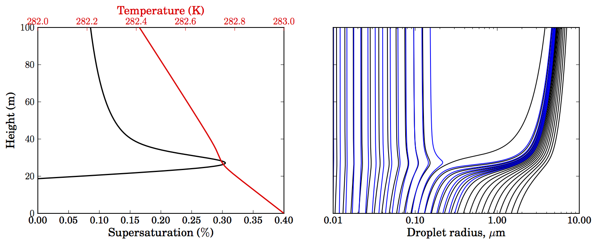

pyrcel: cloud parcel model
==========================

|DOI|\ |PyPI version|\ |Build Status|\ |Documentation Status|\ |Code Style|

.. |DOI| image:: https://zenodo.org/badge/12927551.svg
   :target: https://zenodo.org/badge/latestdoi/12927551
.. |PyPI version| image:: https://badge.fury.io/py/pyrcel.svg
   :target: https://badge.fury.io/py/pyrcel
.. |Build Status| image:: https://circleci.com/gh/darothen/pyrcel/tree/master
.svg?style=svg
   :target: https://circleci.com/gh/darothen/pyrcel/tree/master
.. |Documentation Status| image:: https://readthedocs.org/projects/pyrcel/badge/?version=stable
   :target: http://pyrcel.readthedocs.org/en/stable/?badge=stable
.. |Code Style| image:: https://img.shields.io/badge/code%20style-black-000000
.svg
    :target: https://github.com/python/black

This is an implementation of a simple, 0D adiabatic cloud parcel model tool (following `Nenes et al, 2001`_ and `Pruppacher and Klett, 1997`_). It allows flexible descriptions of an initial aerosol population, and simulates the evolution of a proto-cloud droplet population as the parcel ascends adiabatically at either a constant or time/height-dependent updraft speed. Droplet growth within the parcel is tracked on a Lagrangian grid.

.. _Pruppacher and Klett, 1997: http://books.google.com/books?hl=en&lr=&id=1mXN_qZ5sNUC&oi=fnd&pg=PR15&ots=KhdkC6uhB3&sig=PSlNsCeLSB2FvR93Vzo0ptCAnYA#v=onepage&q&f=false
.. _Nenes et al, 2001: http://onlinelibrary.wiley.com/doi/10.1034/j.1600-0889.2001.d01-12.x/abstract

You are invited to use the model (in accordance with the `licensing <https://raw
.githubusercontent.com/darothen/pyrcel/master/LICENSE>`_), but please get in
touch with the author via `e-mail <mailto:daniel@danielrothenberg.com>`_ or on
`twitter <https://twitter.com/darothen>`_. p-to-date versions can be obtained
through the model's `github repository <https://github.com/darothen/pyrcel>`_
or directly from the author. If you use the model for research, please cite
`this journal article <http://journals.ametsoc.org/doi/abs/10.1175/JAS-D-15-0223.1>`_
which details the original model formulation:

| Daniel Rothenberg and Chien Wang, 2016: Metamodeling of Droplet Activation for Global Climate Models. *J. Atmos. Sci.*, **73**, 1255–1272. doi: http://dx.doi.org/10.1175/JAS-D-15-0223.1

|
|

Documentation Outline
---------------------

.. toctree::
    :maxdepth: 2
    :glob:

    sci_descr
    install
    examples/*
    parcel
    reference

Current version: |version|

Documentation last compiled: |today|
