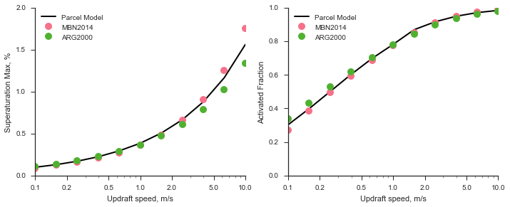

.. _example_activate:

.. currentmodule:: parcel_model

Example: Activation
===================

In this example, we will study the effect of updraft speed on the
activation of a lognormal ammonium sulfate accumulation mode aerosol.

.. code:: python

    # Suppress warnings
    import warnings 
    warnings.simplefilter('ignore')
    
    import pyrcel as pm
    import numpy as np
    
    %matplotlib inline
    import matplotlib.pyplot as plt
    import seaborn as sns

First, we indicate the parcel's initial thermodynamic conditions.

.. code:: python

    P0 = 100000. # Pressure, Pa
    T0 = 279.    # Temperature, K
    S0 = -0.1   # Supersaturation, 1-RH

We next define the aerosol distribution to follow the reference
simulation from `Ghan et al,
2011 <http://onlinelibrary.wiley.com/doi/10.1029/2011MS000074/abstract>`__

.. code:: python

    aer =  pm.AerosolSpecies('ammonium sulfate', 
                              pm.Lognorm(mu=0.05, sigma=2.0, N=1000.),
                              kappa=0.7, bins=100)

Loop over updraft several velocities in the range 0.1 - 10.0 m/s. We
will peform a detailed parcel model calculation, as well as calculations
with two activation parameterizations. We will also use an accommodation
coefficient of :math:`\alpha_c = 0.1`, following the recommendations of
`Raatikainen et al (2013) <http://www.pnas.org/content/110/10/3760>`__.

First, the parcel model calculations:

.. code:: python

    from pyrcel import binned_activation
    
    Vs = np.logspace(-1, np.log10(10,), 11.)[::-1] # 0.1 - 5.0 m/s
    accom = 0.1
    
    smaxes, act_fracs = [], []
    for V in Vs:
        # Initialize the model
        model = pm.ParcelModel([aer,], V, T0, S0, P0, accom=accom, console=False)
        par_out, aer_out = model.run(t_end=2500., dt=1.0, solver='cvode',
                                     output='dataframes', terminate=True)
        print(V, par_out.S.max())
        
        # Extract the supersaturation/activation details from the model
        # output
        S_max = par_out['S'].max()
        time_at_Smax = par_out['S'].argmax()
        wet_sizes_at_Smax = aer_out['ammonium sulfate'].ix[time_at_Smax].iloc[0]
        wet_sizes_at_Smax = np.array(wet_sizes_at_Smax.tolist())
    
        frac_eq, _, _, _ = binned_activation(S_max, T0, wet_sizes_at_Smax, aer)
        
        # Save the output
        smaxes.append(S_max)
        act_fracs.append(frac_eq)

.. parsed-literal::

    [CVode Warning] b'At the end of the first step, there are still some root functions identically 0. This warning will not be issued again.'
    10.0 0.0156189147154
    [CVode Warning] b'At the end of the first step, there are still some root functions identically 0. This warning will not be issued again.'
    6.3095734448 0.0116683910368
    [CVode Warning] b'At the end of the first step, there are still some root functions identically 0. This warning will not be issued again.'
    3.98107170553 0.00878287310116
    [CVode Warning] b'At the end of the first step, there are still some root functions identically 0. This warning will not be issued again.'
    2.51188643151 0.00664901290831
    [CVode Warning] b'At the end of the first step, there are still some root functions identically 0. This warning will not be issued again.'
    1.58489319246 0.00505644091867
    [CVode Warning] b'At the end of the first step, there are still some root functions identically 0. This warning will not be issued again.'
    1.0 0.00385393398982
    [CVode Warning] b'At the end of the first step, there are still some root functions identically 0. This warning will not be issued again.'
    0.63095734448 0.00293957320198
    [CVode Warning] b'At the end of the first step, there are still some root functions identically 0. This warning will not be issued again.'
    0.398107170553 0.00224028774582
    [CVode Warning] b'At the end of the first step, there are still some root functions identically 0. This warning will not be issued again.'
    0.251188643151 0.00170480101361
    [CVode Warning] b'At the end of the first step, there are still some root functions identically 0. This warning will not be issued again.'
    0.158489319246 0.0012955732509
    [CVode Warning] b'At the end of the first step, there are still some root functions identically 0. This warning will not be issued again.'
    0.1 0.000984803827635

Now the activation parameterizations:

.. code:: python

    smaxes_arg, act_fracs_arg = [], []
    smaxes_mbn, act_fracs_mbn = [], []
    
    for V in Vs:
        smax_arg, _, afs_arg = pm.arg2000(V, T0, P0, [aer], accom=accom)
        smax_mbn, _, afs_mbn = pm.mbn2014(V, T0, P0, [aer], accom=accom)
    
        smaxes_arg.append(smax_arg)
        act_fracs_arg.append(afs_arg[0])
        smaxes_mbn.append(smax_mbn)
        act_fracs_mbn.append(afs_mbn[0])

Finally, we compile our results into a nice plot for visualization.

.. code:: python

    sns.set(context="notebook", style='ticks')
    sns.set_palette("husl", 3)
    fig, [ax_s, ax_a] = plt.subplots(1, 2, sharex=True, figsize=(10,4))
    
    ax_s.plot(Vs, np.array(smaxes)*100., color='k', lw=2, label="Parcel Model")
    ax_s.plot(Vs, np.array(smaxes_mbn)*100., linestyle='None', 
              marker="o", ms=10, label="MBN2014" )
    ax_s.plot(Vs, np.array(smaxes_arg)*100., linestyle='None', 
              marker="o", ms=10, label="ARG2000" )
    ax_s.semilogx()
    ax_s.set_ylabel("Superaturation Max, %")
    ax_s.set_ylim(0, 2.)
    
    ax_a.plot(Vs, act_fracs, color='k', lw=2, label="Parcel Model")
    ax_a.plot(Vs, act_fracs_mbn, linestyle='None', 
              marker="o", ms=10, label="MBN2014" )
    ax_a.plot(Vs, act_fracs_arg, linestyle='None', 
              marker="o", ms=10, label="ARG2000" )
    ax_a.semilogx()
    ax_a.set_ylabel("Activated Fraction")
    ax_a.set_ylim(0, 1.)
    
    plt.tight_layout()
    sns.despine()
    
    for ax in [ax_s, ax_a]:
        ax.legend(loc='upper left')
        ax.xaxis.set_ticks([0.1, 0.2, 0.5, 1.0, 2.0, 5.0, 10.0])
        ax.xaxis.set_ticklabels([0.1, 0.2, 0.5, 1.0, 2.0, 5.0, 10.0])
        ax.set_xlabel("Updraft speed, m/s")

