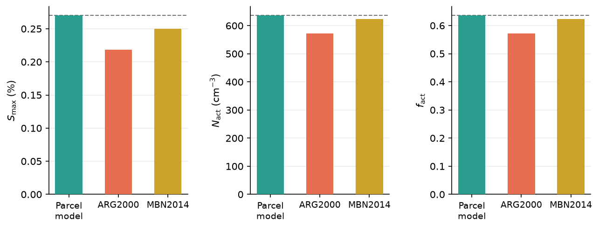

# Activation Comparison

Compares peak supersaturation $S_\text{max}$, activated droplet number $N_\text{act}$,
and activated fraction $f_\text{act}$ predicted by the full parcel model against two
widely-used analytical parameterizations:

- **ARG2000** — Abdul-Razzak & Ghan (2000), the standard GCM parameterization.
- **MBN2014** — Morales Betancourt & Nenes (2014), an iterative improvement that
  accounts for non-equilibrium growth effects.

Both parameterizations are JAX-native, so their outputs are differentiable via
`jax.grad` alongside the parcel model itself.

**Script:** [`examples/activation_comparison.py`](https://github.com/darothen/pyrcel/blob/master/examples/activation_comparison.py)

```bash
python examples/activation_comparison.py
python examples/activation_comparison.py --V 2.0 --mu 0.05 --N 500 --kappa 0.54
python examples/activation_comparison.py --plot output/activation_comparison.png
```

## Setup

```python
import pyrcel as pm
from pyrcel.activation import arg2000, mbn2014
import jax.numpy as jnp

aerosol = pm.AerosolSpecies(
    "sulfate",
    pm.Lognorm(mu=0.05, sigma=2.0, N=1000.0),
    kappa=0.54, bins=100,
)

# Ground truth: full ODE integration
model = pm.ParcelModel([aerosol], V=1.0, T0=283.0, S0=-0.02, P0=85000.0)
model.run(300.0, output_dt=1.0, terminate=True)
s = model.summary()

# Analytical parameterizations (single call, no ODE)
mus  = jnp.array([0.05])   # µm
sigs = jnp.array([2.0])
Ns   = jnp.array([1000.0]) # cm⁻³
kaps = jnp.array([0.54])

smax_arg, Nact_arg, frac_arg = arg2000(1.0, 283.0, 85000.0, mus, sigs, Ns, kaps)
smax_mbn, Nact_mbn, frac_mbn = mbn2014(1.0, 283.0, 85000.0, mus, sigs, Ns, kaps)
```

## Console output

```
--8<-- "docs/assets/output/activation_comparison.txt"
```

## Output figure



Each panel compares the same quantity across the three methods. The dashed horizontal
line marks the parcel-model reference. At these conditions (V = 1 m/s, μ = 0.05 µm):

- **ARG2000** underestimates $S_\text{max}$ by ~19% and $N_\text{act}$ by ~10%,
  consistent with its known low bias at moderate updraft speeds.
- **MBN2014** agrees more closely with the parcel model (~7% in $S_\text{max}$,
  ~2% in $N_\text{act}$), reflecting its improved treatment of non-equilibrium
  droplet growth.

Errors vary with aerosol size, hygroscopicity, and updraft speed — see
[Sensitivity Sweep](sensitivity_sweep.md) for how the relative performance of each
method changes across the $(V, \mu)$ parameter space.

## Differentiating parameterizations

Because `arg2000` and `mbn2014` are pure JAX functions, their gradients with respect
to any input are available at no extra cost:

```python
import jax

def nact_mbn(V, mu):
    _, Nact, _ = mbn2014(
        V, 283.0, 85000.0,
        jnp.array([mu]), jnp.array([2.0]),
        jnp.array([1000.0]), jnp.array([0.54]),
    )
    return Nact[0]

dNact_dV  = jax.grad(nact_mbn, argnums=0)(1.0, 0.05)
dNact_dmu = jax.grad(nact_mbn, argnums=1)(1.0, 0.05)
```

These exact analytical gradients are compared against the parcel model's gradients
in the [Sensitivity Sweep](sensitivity_sweep.md) example.
