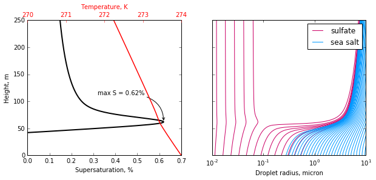

.. _example_basic:

.. currentmodule:: parcel_model

Example: Basic Run
==================

In this example, we will setup a simple parcel model simulation
containing two aerosol modes. We will then run the model with a 1 m/s
updraft, and observe how the aerosol population bifurcates into swelled
aerosol and cloud droplets.

.. code:: python

    # Suppress warnings
    import warnings 
    warnings.simplefilter('ignore')
    
    import pyrcel as pm
    import numpy as np
    
    %matplotlib inline
    import matplotlib.pyplot as plt

.. parsed-literal::

    Could not find GLIMDA

First, we indicate the parcel's initial thermodynamic conditions.

.. code:: python

    P0 = 77500. # Pressure, Pa
    T0 = 274.   # Temperature, K
    S0 = -0.02  # Supersaturation, 1-RH (98% here)

Next, we define the aerosols present in the parcel. The model itself is
agnostic to how the aerosol are specified; it simply expects lists of
the radii of wetted aerosol radii, their number concentration, and their
hygroscopicity. We can make container objects
(:class:``AerosolSpecies``) that wrap all of this information so that we
never need to worry about it.

Here, let's construct two aerosol modes:

+----------+-----------------------+-----------------+---------+--------------------+
| Mode     | :math:`\kappa`        | Mean size       | Std dev | Number Conc        |
|          | (hygroscopicity)      | (micron)        |         | (cm\*\*-3)         |
+==========+=======================+=================+=========+====================+
| sulfate  | 0.54                  | 0.015           | 1.6     | 850                |
+----------+-----------------------+-----------------+---------+--------------------+
| sea salt | 1.2                   | 0.85            | 1.2     | 10                 |
+----------+-----------------------+-----------------+---------+--------------------+

We'll define each mode using the :class:``Lognorm`` distribution
packaged with the model.

.. code:: python

    sulfate =  pm.AerosolSpecies('sulfate', 
                                 pm.Lognorm(mu=0.015, sigma=1.6, N=850.),
                                 kappa=0.54, bins=200)
    sea_salt = pm.AerosolSpecies('sea salt',
                                 pm.Lognorm(mu=0.85, sigma=1.2, N=10.),
                                 kappa=1.2, bins=40)

The :class:``AerosolSpecies`` class automatically computes
gridded/binned representations of the size distributions. Let's double
check that the aerosol distribution in the model will make sense by
plotting the number concentration in each bin.

.. code:: python

    fig = plt.figure(figsize=(10,5))
    ax = fig.add_subplot(111)
    ax.grid(False, "minor")
    
    sul_c = "#CC0066"
    ax.bar(sulfate.rs[:-1], sulfate.Nis*1e-6, np.diff(sulfate.rs),
            color=sul_c, label="sulfate", edgecolor="#CC0066")
    sea_c = "#0099FF"
    ax.bar(sea_salt.rs[:-1], sea_salt.Nis*1e-6, np.diff(sea_salt.rs),
            color=sea_c, label="sea salt", edgecolor="#0099FF")
    ax.semilogx()
    
    ax.set_xlabel("Aerosol dry radius, micron")
    ax.set_ylabel("Aerosl number conc., cm$^{-3}$")
    ax.legend(loc='upper right')

.. parsed-literal::

    <matplotlib.legend.Legend at 0x10f4baeb8>

.. image:: basic_run_files/basic_run_9_1.png

Actually running the model is very straightforward, and involves just
two steps:

1. Instantiate the model by creating a :class:``ParcelModel`` object.
2. Call the model's :method:``run`` method.

For convenience this process is encoded into several routines in the
``driver`` file, including both a single-strategy routine and an
iterating routine which adjusts the the timestep and numerical
tolerances if the model crashes. However, we can illustrate the simple
model running process here in case you wish to develop your own scheme
for running the model.

.. code:: python

    initial_aerosols = [sulfate, sea_salt]
    V = 1.0 # updraft speed, m/s
    
    dt = 1.0 # timestep, seconds
    t_end = 250./V # end time, seconds... 250 meter simulation 
    
    model = pm.ParcelModel(initial_aerosols, V, T0, S0, P0, console=False, accom=0.3)
    parcel_trace, aerosol_traces = model.run(t_end, dt, solver='cvode')

If ``console`` is set to ``True``, then some basic debugging output will
be written to the terminal, including the initial equilibrium droplet
size distribution and some numerical solver diagnostics. The model
output can be customized; by default, we get a DataFrame and a Panel of
the parcel state vector and aerosol bin sizes as a function of time (and
height). We can use this to visualize the simulation results, like in
the package's
`README <https://github.com/darothen/parcel_model/blob/master/README.md>`__.

.. code:: python

    fig, [axS, axA] = plt.subplots(1, 2, figsize=(10, 4), sharey=True)
    
    axS.plot(parcel_trace['S']*100., parcel_trace['z'], color='k', lw=2)
    axT = axS.twiny()
    axT.plot(parcel_trace['T'], parcel_trace['z'], color='r', lw=1.5)
    
    Smax = parcel_trace['S'].max()*100
    z_at_smax = parcel_trace['z'].ix[parcel_trace['S'].argmax()]
    axS.annotate("max S = %0.2f%%" % Smax, 
                 xy=(Smax, z_at_smax), 
                 xytext=(Smax-0.3, z_at_smax+50.),
                 arrowprops=dict(arrowstyle="->", color='k',
                                 connectionstyle='angle3,angleA=0,angleB=90'),
                 zorder=10)
    
    axS.set_xlim(0, 0.7)
    axS.set_ylim(0, 250)
    
    axT.set_xticks([270, 271, 272, 273, 274])
    axT.xaxis.label.set_color('red')
    axT.tick_params(axis='x', colors='red')
    
    axS.set_xlabel("Supersaturation, %")
    axT.set_xlabel("Temperature, K")
    axS.set_ylabel("Height, m")
    
    sulf_array = aerosol_traces['sulfate'].values
    sea_array = aerosol_traces['sea salt'].values
    
    ss = axA.plot(sulf_array[:, ::10]*1e6, parcel_trace['z'], color=sul_c, 
             label="sulfate")
    sa = axA.plot(sea_array*1e6, parcel_trace['z'], color=sea_c, label="sea salt")
    axA.semilogx()
    axA.set_xlim(1e-2, 10.)
    axA.set_xticks([1e-2, 1e-1, 1e0, 1e1], [0.01, 0.1, 1.0, 10.0])
    axA.legend([ss[0], sa[0]], ['sulfate', 'sea salt'], loc='upper right')
    axA.set_xlabel("Droplet radius, micron")
    
    for ax in [axS, axA, axT]:
        ax.grid(False, 'both', 'both')

In this simple example, the sulfate aerosol population bifurcated into
interstitial aerosol and cloud droplets, while the entire sea salt
population activated. A peak supersaturation of about 0.63% was reached
a few meters above cloud base, where the ambient relative humidity hit
100%.

How many CDNC does this translate into? We can call upon helper methods
from the ``activation`` package to perform these calculations for us:

.. code:: python

    from pyrcel import binned_activation
    
    sulf_trace = aerosol_traces['sulfate']
    sea_trace = aerosol_traces['sea salt']
    
    ind_final = int(t_end/dt) - 1
    
    T = parcel_trace['T'].iloc[ind_final]
    eq_sulf, kn_sulf, alpha_sulf, phi_sulf = \
        binned_activation(Smax/100, T, sulf_trace.iloc[ind_final],  sulfate)
    eq_sulf *= sulfate.total_N
    
    eq_sea, kn_sea, alpha_sea, phi_sea = \
        binned_activation(Smax/100, T, sea_trace.iloc[ind_final], sea_salt)
    eq_sea *= sea_salt.total_N
    
    print("  CDNC(sulfate) = {:3.1f}".format(eq_sulf))
    print(" CDNC(sea salt) = {:3.1f}".format(eq_sea))
    print("------------------------")
    print("          total = {:3.1f} / {:3.0f} ~ act frac = {:1.2f}".format(
          eq_sulf+eq_sea, 
          sea_salt.total_N+sulfate.total_N,
          (eq_sulf+eq_sea)/(sea_salt.total_N+sulfate.total_N)
    ))

.. parsed-literal::

      CDNC(sulfate) = 146.9
     CDNC(sea salt) = 10.0
    ------------------------
              total = 156.9 / 860 ~ act frac = 0.18

