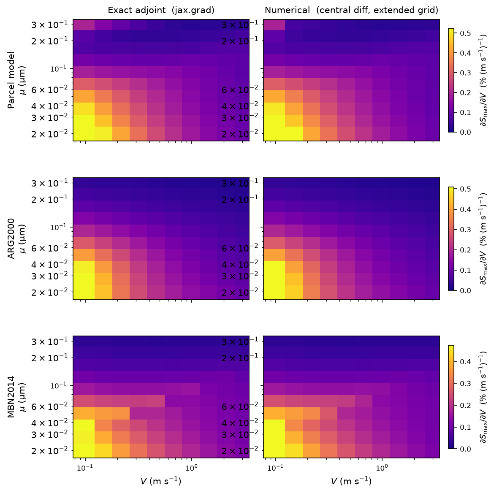

# Sensitivity Sweep: Exact vs Numerical ∂Smax/∂V

Compares the sensitivity of peak supersaturation $\partial S_\text{max}/\partial V$
computed two ways — via the **exact adjoint (jax.grad)** and via **numerical
central-difference** approximation — for each of three methods:

| Method | Implementation | Exact gradient source |
|--------|---------------|-----------|
| Parcel model | Full ODE (JAX/diffrax) | `jax.grad` through the integrator (adjoint) |
| ARG2000 | Closed-form | `jax.grad` (analytical) |
| MBN2014 | Iterative | `jax.grad` via implicit function theorem (IFT) |

The figure has three columns per row: the exact adjoint, the numerical central-difference
estimate on an extended grid, and the signed error (exact − numerical).
Comparing the first two columns reveals where finite-difference approximation on a
coarse grid diverges from the true gradient; the third column makes the discrepancy
explicit and symmetric.

**Script:** [`examples/sensitivity_sweep.py`](https://github.com/darothen/pyrcel/blob/master/examples/sensitivity_sweep.py)

```bash
python examples/sensitivity_sweep.py              # compute, cache, plot
python examples/sensitivity_sweep.py --recompute  # force fresh sweep
python examples/sensitivity_sweep.py --no-plot    # cache only
python examples/sensitivity_sweep.py --cache PATH --plot PATH
```

## Caching

The parcel model requires one JIT-compiled forward pass and one adjoint call
per grid point (100 points on the default 10 × 10 grid). Results are saved to
a compressed `.npz` cache so the figure can be regenerated without re-running
the integrator:

```python
import numpy as np

data = np.load("output/sensitivity_sweep_cache.npz")
smax_parcel            = data["smax_parcel"]            # shape (n_V, n_mu)
dsmax_dV_parcel_exact  = data["dsmax_dV_parcel_exact"]  # exact adjoint
dsmax_dV_parcel_num    = data["dsmax_dV_parcel_num"]    # numpy.gradient
V_grid                 = data["V_grid"]
mu_grid                = data["mu_grid"]
```

The cache is invalidated automatically if the grid dimensions or aerosol
parameters differ between runs.

## How adjoint and numerical gradients are computed

For the parameterizations, the exact gradient is a single `jax.grad` call:

```python
import jax
import jax.numpy as jnp
from pyrcel.activation import arg2000

def smax_arg(V, mu):
    s, _, _ = arg2000(
        V, 283.0, 85000.0,
        jnp.array([mu]), jnp.array([2.0]),
        jnp.array([1000.0]), jnp.array([0.54]),
    )
    return s

dS_dV_exact = jax.grad(smax_arg, argnums=0)(1.0, 0.05)
```

For the parcel model, the adjoint is computed the same way but the function
wraps the ODE integrator.  The output time grid `ts` varies with `V` (to keep
the integration horizon near ~1500 m for every grid point), so it is passed as
an explicit argument alongside the other inputs so the JIT-compiled kernel is
reused across the grid:

```python
from pyrcel.integrator import max_supersaturation
from pyrcel.updraft import ConstantV

def smax_parcel(V_val, y0, r_drys, Nis, kappas_arr, ts):
    return max_supersaturation(
        y0, (r_drys, Nis, kappas_arr, accom, ConstantV(V_val)), ts
    )

grad_parcel = jax.jit(jax.grad(smax_parcel, argnums=0))
dS_dV_exact = grad_parcel(V_val, y0, r_drys, Nis, kappas_arr, ts)
```

The JIT compilation happens once on the first call; all subsequent grid points
reuse the compiled kernel.  Passing `ts` as an argument does not bias the
gradient: by the envelope theorem, `d(S_max)/d(t_end) = 0` whenever the
supersaturation peak is strictly interior to `[t0, t_end]`, so the
`∂S_max/∂t_end · dt_end/dV` coupling term vanishes identically.

### Numerical gradient

The numerical approximation is computed on an extended grid — one extra
log-spaced node in each direction beyond the original (V, μ) grid — so that
every original node uses a central difference rather than a one-sided estimate.
The gradient values are then interpolated back to the original grid using
bilinear interpolation in log(V) × log(μ) space:

```python
import numpy as np
from scipy.interpolate import RegularGridInterpolator

# Evaluate S_max on the extended grid, then take central differences.
dsmax_dV_ext = np.gradient(smax_ext, V_ext, axis=0)

# Interpolate back to original nodes in log-space.
interp = RegularGridInterpolator(
    (np.log10(V_ext), np.log10(mu_ext)),
    dsmax_dV_ext, method="linear",
)
coords = np.array([[np.log10(V), np.log10(mu)] for V in V_grid for mu in mu_grid])
dsmax_dV_num = interp(coords).reshape(len(V_grid), len(mu_grid))
```

## Output figure



**Layout:** 3 rows × 3 columns. Each row is one method.

| Column | Content | Colormap |
|--------|---------|----------|
| Left | Exact adjoint (`jax.grad`) | plasma (0 → max) |
| Centre | Numerical (central diff, extended grid) | plasma, shared scale |
| Right | Signed error: exact − numerical | RdBu_r, symmetric about 0 |

Two horizontal colorbars are shown below the grid: one shared plasma scale for
the left and centre columns, and one symmetric diverging scale for the error
column.  Both scales are global across all three rows.

**Parcel model (row 1).** The adjoint is obtained by backpropagating through
the full ODE solver using a cubic Hermite interpolant constructed post-hoc from
the saved discrete trajectory (`SaveAt(ts=ts)`).  The ODE right-hand side
supplies exact endpoint derivatives at the three bracket points, and the
supersaturation peak is located analytically by solving the resulting quadratic
`dp/du = 0` — eliminating the aliasing that arises when the adaptive
integrator's step structure shifts with V.  The error column shows a roughly
structured residual — mostly blue (exact < numerical) at small μ and low V —
reflecting coarse-grid truncation error in the numerical estimate.

**ARG2000 (row 2).** The closed-form parameterization is fully differentiable
at negligible cost. The error column is nearly white across most of the domain,
confirming that the two methods agree closely and providing a sanity check for
both the adjoint and the extended-grid numerical approach.

**MBN2014 (row 3).** Uses a `jax.custom_vjp` wrapper over a `while_loop`
bisection, with the implicit function theorem (IFT) supplying the backward
pass. Gradients are available across the full (V, μ) range, including the
"critical" population-splitting regime (large μ) that previously produced NaN
due to a `sqrt(max(x, 0))` anti-pattern in the backward pass. The error column
shows the largest signed residuals along the critical-branch boundary, where
both the IFT gradient and the coarse-grid numerical estimate are least smooth.
